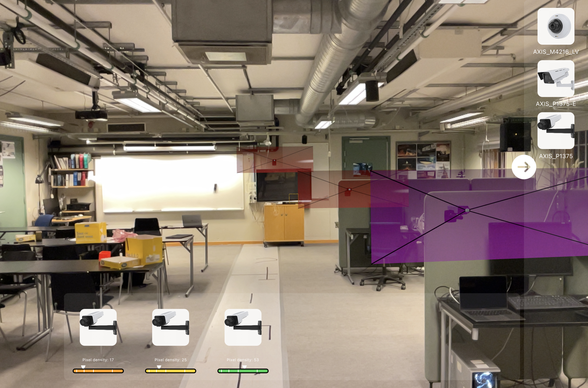
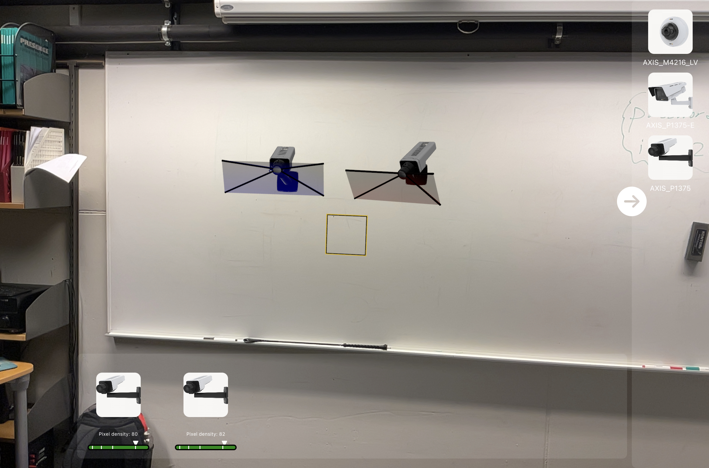
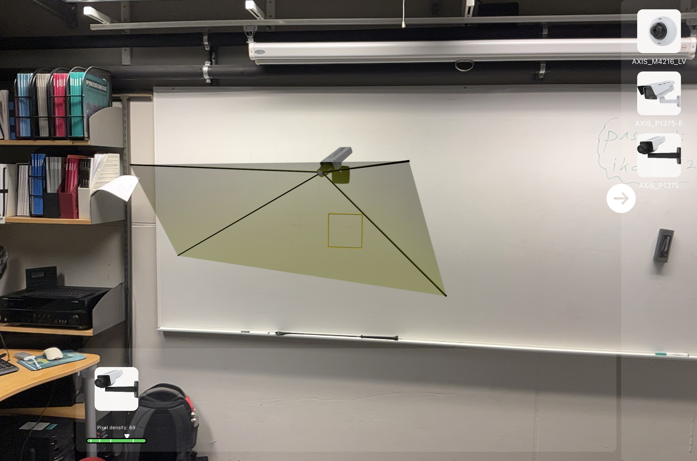

# Authors

* iCurbix (https://github.com/iCurbix)
* me (https://github.com/aleksykrolczyk)

# Description
The app uses LIDAR sensor found in Apple Pro devices to scan the environement and allows to place and maniulate cameras to visualize what the cameras would see. The cameras are based on real devices with their real parameters used.

Apart from the visualization, based on the device position the app calculates in real-time, separately for every placed camera, whether the camera sees the iPad and based on the distance calculates the pixel density.

The 3D models were replaced with simple balls due to ownership rights. Sorry!

## Note:
Whole development was done on iPad PRO so we can't guarantee the UI will look nicely on iPhones.

# Some photos

